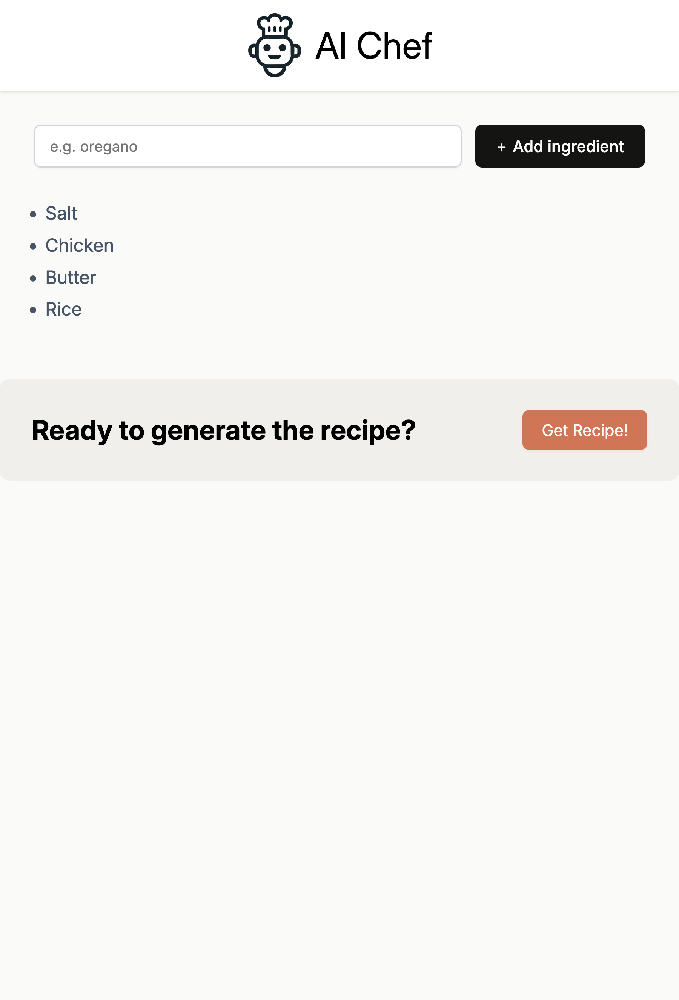
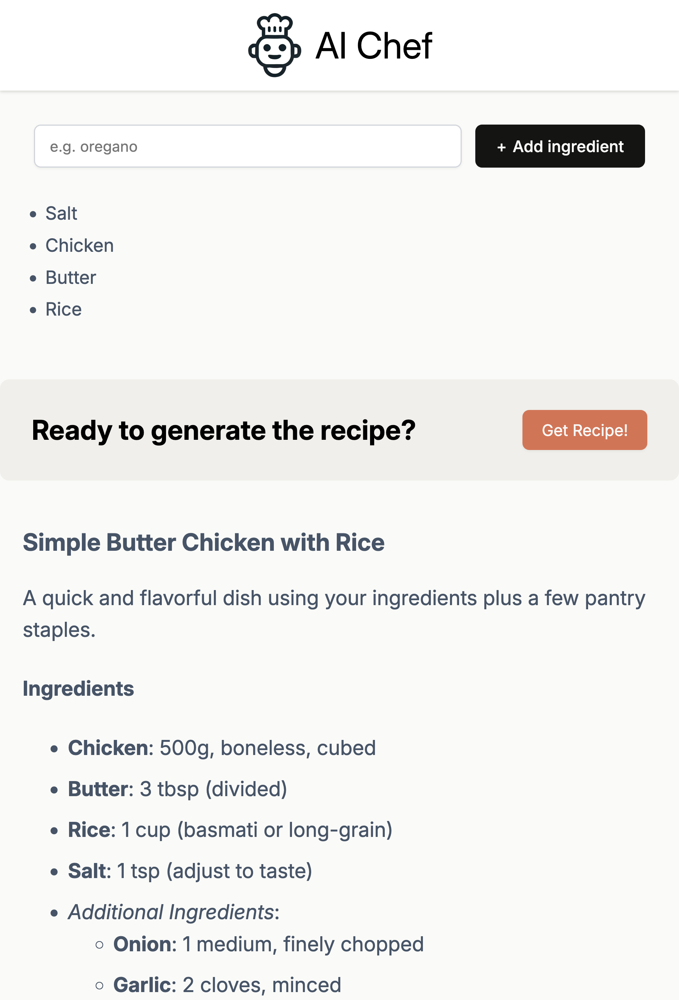

# AI Chef

Generate delicious recipes from a list of ingredients using a lightweight React + Vite app backed by Hugging Face Inference.




## Features

- Add ingredients and generate a full recipe in Markdown
- Renders Markdown safely with react-markdown
- Uses Hugging Face Inference Chat Completions API
- Small, fast Vite + React setup

## Tech stack

- React 19 + Vite 7
- @huggingface/inference client
- react-markdown for rendering output
- ESLint with React Hooks and Refresh rules

## Project structure

```
ai-chef/
├─ public/
│  ├─ 1.png
│  ├─ 2.png
│  └─ ai-chef-icon.ico
├─ src/
│  ├─ App.jsx
│  ├─ main.jsx
│  ├─ index.css
│  ├─ App.css
│  ├─ components/
│  │  ├─ Header.jsx
│  │  ├─ Main.jsx
│  │  ├─ IngredientList.jsx
│  │  └─ AIRecipe.jsx
│  └─ services/
│     └─ ai.js
├─ index.html
├─ vite.config.js
├─ eslint.config.js
└─ package.json
```

## Getting started

Prerequisites: Node.js 18+ and npm.

1. Install dependencies

```
npm install
```

2. Configure the API key

- The app uses Hugging Face Inference via `@huggingface/inference`.
- For local testing, you can set the token in an env file (recommended) and update the code to read it, or temporarily paste your token into `src/services/ai.js` (not recommended for production).

3. Run the dev server

```
npm run dev
```

Open the printed local URL (usually http://localhost:5173).

4. Build for production

```
npm run build
npm run preview
```

## How it works

- `src/services/ai.js` calls `client.chatCompletion` with model `deepseek-ai/DeepSeek-R1` and provider `together`, passing a short system prompt and the user’s ingredient list.
- The response may include <think>…</think> traces; these are stripped by `removeThinkTags` before rendering.
- `AIRecipe.jsx` renders the returned Markdown with `react-markdown`.

## Usage tips

- Add at least 4 ingredients to enable recipe generation.
- If rate-limited or an error occurs, you’ll see: "Try again after a minute!"
- After a successful generation, the button is disabled to avoid duplicate requests.

## Configuration

You can tweak the generation parameters in `src/services/ai.js`:

- `max_tokens: 5000`
- `temperature: 0.3`
- `system` prompt: constrains output to a valid food recipe in Markdown.

## Scripts

- `npm run dev` — start dev server
- `npm run build` — build for production
- `npm run preview` — preview the production build
- `npm run lint` — run ESLint

## Security notes

- Do not commit secrets. Prefer env vars (e.g., `.env.local`).
- Client-side keys can be exposed; consider proxying requests through a backend for production apps.

## License

MIT

## Acknowledgements

- Hugging Face Inference API
- DeepSeek model authors and Together provider
